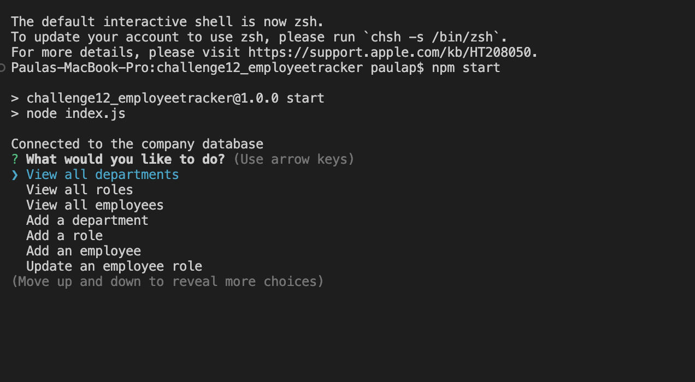
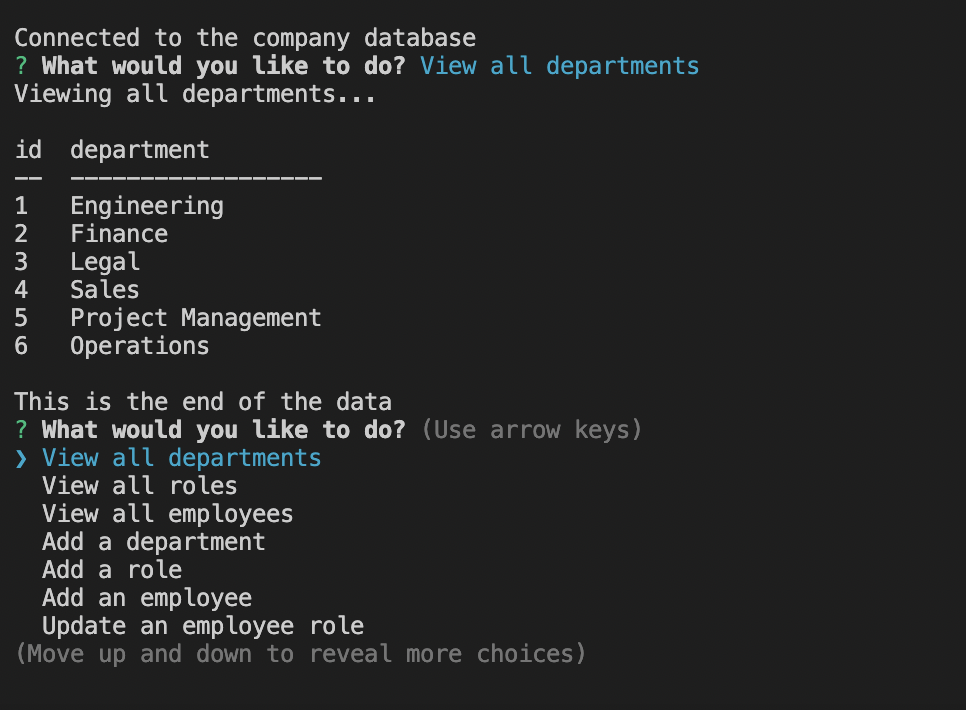
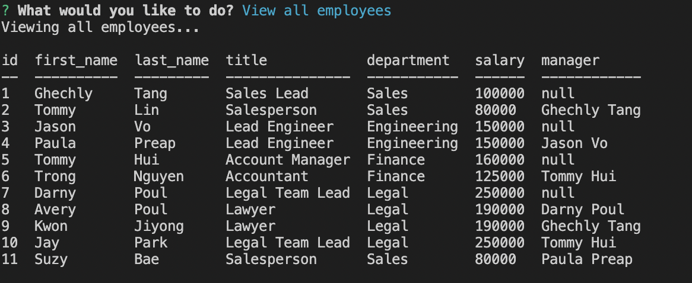
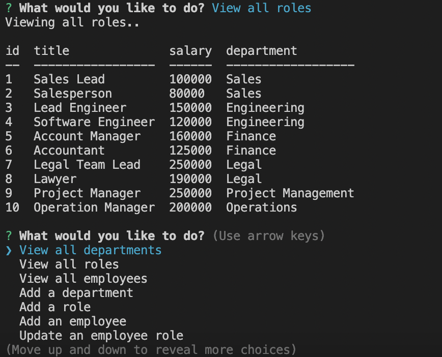
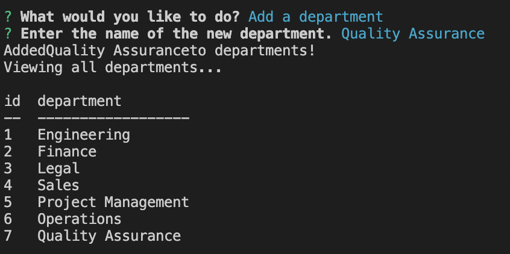
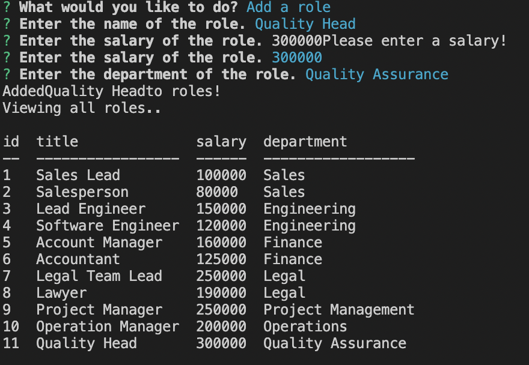
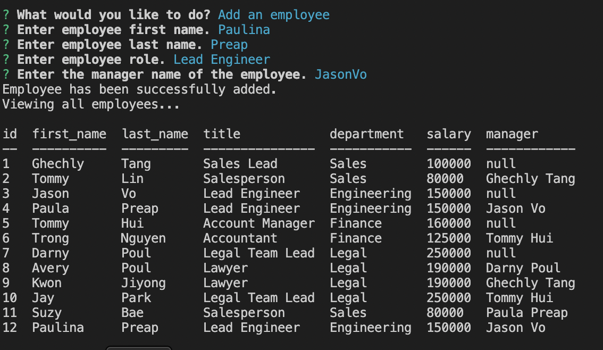
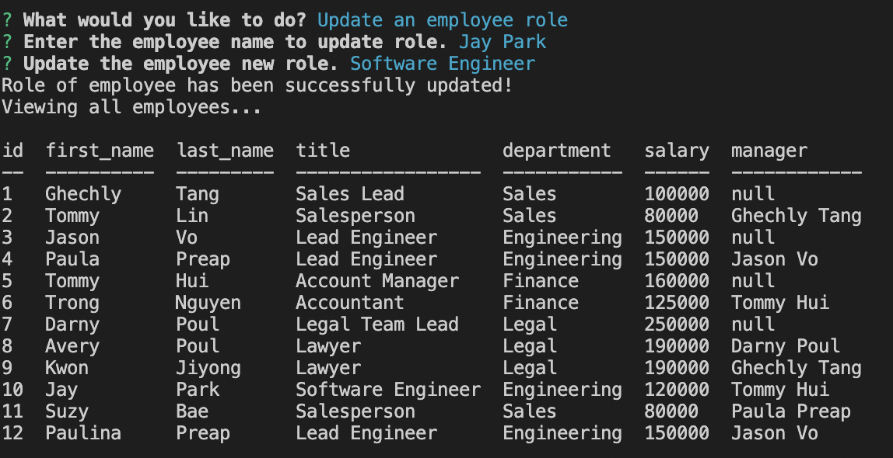

# Module 12: SQL Challenge: Employee Tracker

Using Node.js, Inquirer, and MySQL, a command-line application will be created that allow users to easily view and interact with information stored in databases. 
Link to [Application Functionality Video]:(https://youtu.be/hWRVFf5e3oQ)

# User Story for Employee Tracker

An business owner wants to be able to view and manage the departments, roles, and employees in their company so they can organize and plan their business better.
The developer will create an command line application that will fulfill these criterias.

**Technologies Used: Node.js, npm, Inquirer, MySQL**
- MySQL2 package will be needed to connect to MySQL database and perform queries.
- The Inquirer package to interact with the user via command line.
- The console.table package to print MySQL rows to the console.

The following video shows an example of the application being used from the command line: (https://youtu.be/hWRVFf5e3oQ)

## Criteria

Create a command-line application that accepts user input

WHEN the user **start the application**
THEN  is **presented with the following options: view all departments, view all roles, view all employees, add a department, add a role, add an employee, and update an employee role**

WHEN the user **choose to view all departments**
THEN is presented with a **formatted table showing department names and department ids**

WHEN the user **choose to view all roles**
THEN is presented with the **job title, role id, the department that role belongs to, and the salary for that role**

WHEN the user choose to **view all employees**
THEN is presented with a **formatted table showing employee data, including employee ids, first names, last names, job titles, departments, salaries, and managers that the employees report to**

WHEN the user **choose to add a department**
THEN is **prompted to enter the name of the department and that department is added to the database**

WHEN the user **choose to add a role**
THEN is **prompted to enter the name, salary, and department for the role and that role is added to the database**

WHEN the user **choose to add an employee**
THEN is **prompted to enter the employee’s first name, last name, role, and manager, and that employee is added to the database**

WHEN the user **choose to update an employee role**
THEN is **prompted to select an employee to update and their new role and this information is updated in the database**

## Installation
**You will need to run to have access to MySQL Server and login info.**
You will need to have Node.js installed on your computer.
You will need to clone the starter code from the project repository.
You will need to make sure you are in the main directory of the project folder.
You will need to install npm packages needed for inquirer, mysql2, and console.table
run 
- npm init
- npm i
- npm i inquirer@8.2.4
- npm start

### Assets
These are images of the working application functionalities: start application, view all departments, roles, employees,  add role, department or new employee or update role in the company database via the command line.

#### Links
[Github Repository](https://github.com/pppreap/challenge12_employeetracker) 
///
[Link to  Functionality Video](https://youtu.be/hWRVFf5e3oQ)

#### License/ Credits
User Story and Criterias from Michigan State University Boot Camp.

